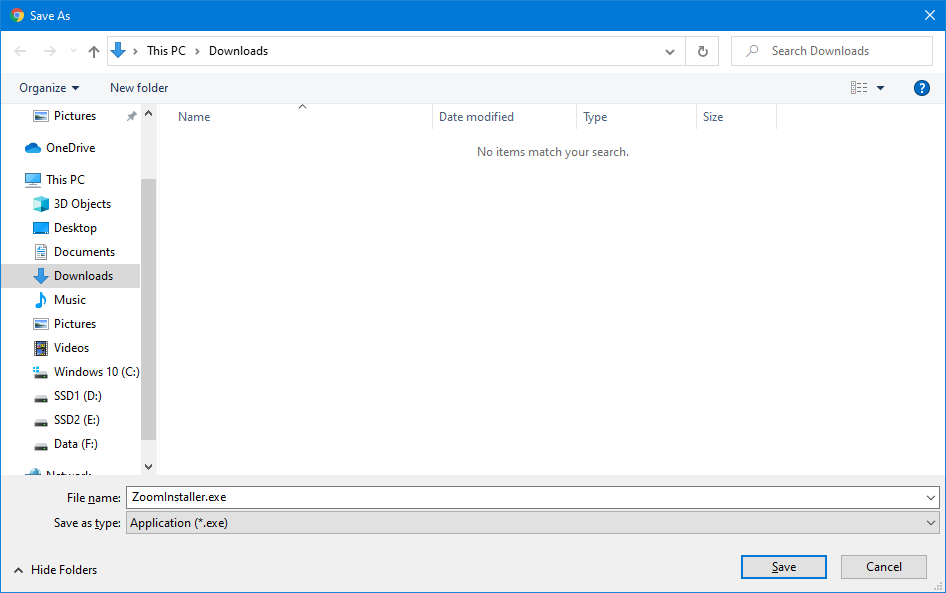
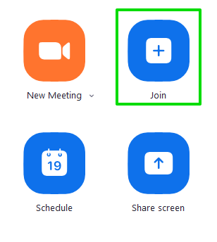

# Zoom Quickstart Guide for Windows

With the sharp increase in the number of people remaining indoors and working from home in 2020, you may have been asked or recommended to use Zoom to join a video call with family, friends, or for work. If you're new to Zoom, don't worry: until this year, it was unfamiliar to most people, and it's fairly straightforward to use.

In this guide we will explain how to do the following on a Windows 7, 8, or 10 computer:
- [Install Zoom](#installing-zoom-on-windows)
- [Join a Zoom meeting](#joining-a-zoom-meeting)

## Why not use the Zoom web client?

While the Zoom web client is ideal for joining and hosting one-time meetings, the Zoom desktop client gives you more options and flexibility, such as the ability to schedule meetings, record them to your computer, and more control over your privacy. This guide covers the desktop client, so your system will be ready should you need these more advanced features.

## Installing Zoom on Windows

On a Windows computer, the Zoom client is tied to a Windows account. If multiple accounts on the same computer need Zoom, you must install it again, separately, under those accounts.

To install Zoom on your Windows account:

1. Log in to your Windows account.
2. In a web browser such as Chrome or Firefox, navigate to the Zoom download page: https://zoom.us/download. 
3. Download the installer under _Zoom Client for Meetings_. 
    - If you are prompted to choose a file destination, select an appropriate location in the file dialog. 
4. Once downloaded, run the installer by clicking the file in your browser's download bar. .
5. Windows might interrupt with a security warning. Click _Run_ to begin installing Zoom. 
6. Once it has finished installing, Zoom will launch. 

Zoom is now installed for your user account. From here, you can immediately join someone else's meeting, or log in to Zoom to host and schedule your own meetings.

## Joining a Zoom meeting

There are two ways to join a Zoom meeting:
- [With a link](#connecting-with-a-link)
- [With a meeting ID and password](#connecting-with-an-id-and-password)

Here is an example of a Zoom meeting invitation attached to a Google Calendar event, with both methods displayed: 

Both ways will allow you to connect to the meeting, but the meeting host may have only provided you with one or the other. The link is the faster method.

### Connecting with a link (recommended)

If you have been provided with a link to the meeting:

1. Click the link. You will be taken to a Zoom download page.
2. Your browser will ask if you want to open the link with the Zoom desktop client. Click _Open_ to launch Zoom and automatically connect to the meeting.

Once connected, you can [join the meeting](#joining-the-meeting).

### Connecting with an ID and password

If you have been provided with an ID and password for the meeting:

1. Launch Zoom:
    - Open the Start Menu, then search for and select Zoom. 
    - If you have logged in to Zoom before, you can also launch Zoom from the desktop shortcut. 
2. Connect to the meeting:
    - Click _Join a Meeting_. 
    - If you are logged in, click the _Join_ button. 
3. Copy-paste or type the 11-digit meeting ID. 
4. Copy-paste or type the 6-character meeting password. 

Once connected, you can [join the meeting](#joining-the-meeting).

### Joining the meeting

Once you have connected to the meeting, there are a few extra steps before you can join:

1. A preview of your webcam feed will appear. You can take this time to adjust your appearance and your surroundings. If you wish to join with your webcam turned on, click _Join with Video_. If you wish to join with your webcam turned off, click _Join without Video_.
2. A temporary blind will appear while you wait for the host to allow you entry into the meeting. There's nothing you can do now but wait!
3. You will be prompted to allow Zoom to use your computer audio. Click _Join with Computer Audio_.

By now you should be joined to the Zoom meeting, and you can begin watching and participating.